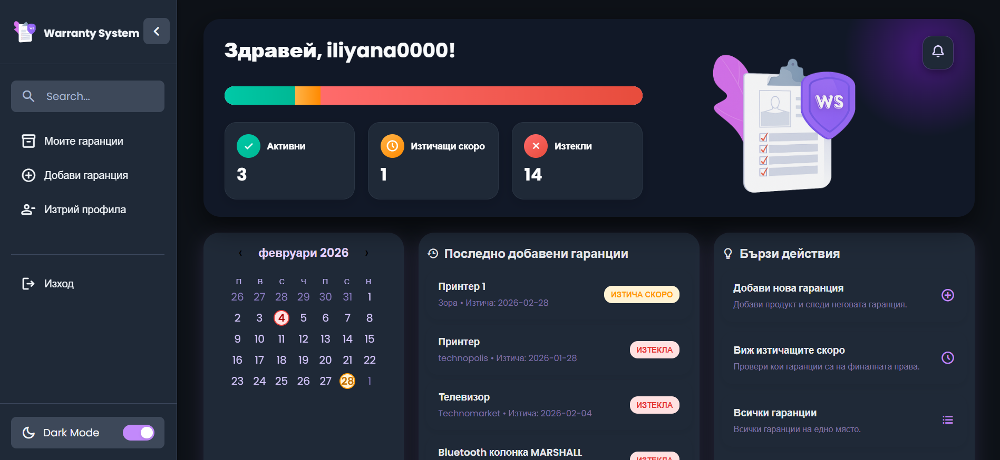
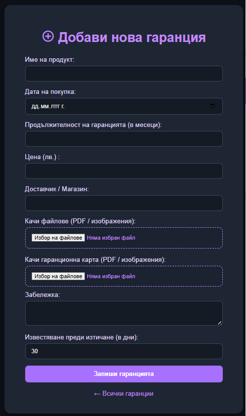

# Warranty Management System

## Overview
Internal web-based business management system designed to handle warranty records, user approvals, and automated notifications.

The system follows real-world workflows such as account activation, admin approval, warranty lifecycle tracking, and proactive reminder notifications.

---

## Problem
Many businesses manage warranties manually, which often leads to:
- Missed expiration dates
- Poor visibility over active warranties
- Inefficient communication with users

---

## Solution
A centralized system that:
- Manages warranty records throughout their entire lifecycle
- Controls user access via email verification and admin approval
- Automatically notifies users before warranty expiration
- Provides clear dashboards and status tracking

---

## Key Features
- Secure user registration with email verification
- Admin approval workflow before account activation
- Role-based access control (Admin / User)
- Dashboard with warranty statistics
- Warranty lifecycle tracking (Active, Expiring, Expired)
- Automated email reminders before expiration
- In-app notification system for important events

---

## Screenshots
Below are real screenshots from the running system.

### Login & Account Activation

### User Dashboard

### Admin Panel

### Add Warranty

---

## Tech Stack
- PHP
- MySQL
- HTML / CSS / JavaScript
- PHPMailer

---

## What This Project Demonstrates
- Design and implementation of real-world business systems
- User onboarding and admin approval workflows
- Time-based automation and notification logic
- Backend-driven dashboards and data management
